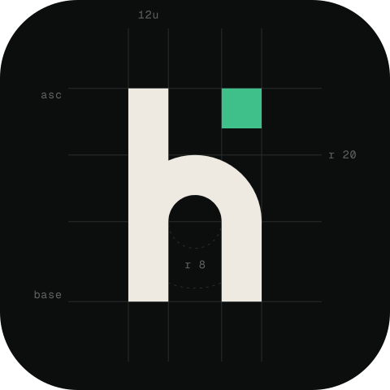
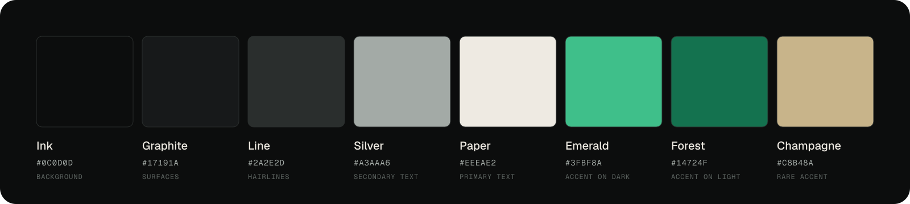
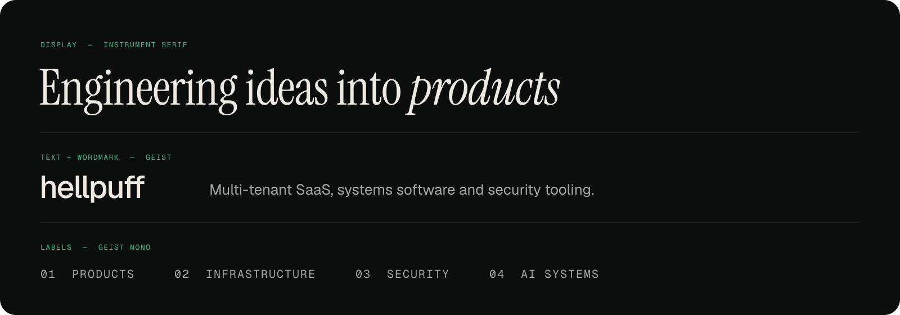

# hellpuff brand guide

A small identity system for GitHub, [hellpuff.dev](https://www.hellpuff.dev) and anything else I publish.
Every asset in `assets/` is generated from `tools/build-brand.mjs`, so changes start there.

## The mark



A geometric lowercase **h**, drawn on a 96-unit box with a 4-unit grid:

- One stroke weight of 12 units for the stem, arch and leg.
- The arch is a 20-unit outer radius over an 8-unit counter, both springing from y = 56.
- A single **emerald square**, the same width as the stroke, sits in the leg's column at ascender height.

The glyph is the structure; the square is the idea that ships. Together they close a rectangle, which is why the
mark holds its shape as a 16-pixel favicon and as a circular avatar.

| File | Use |
| :-- | :-- |
| `hellpuff-mark.svg` | Mark on dark backgrounds |
| `hellpuff-mark-ink.svg` | Mark on light backgrounds |
| `hellpuff-avatar.svg`, `hellpuff-avatar.png` | Square avatar, safe inside a circle crop (1024 × 1024 PNG) |
| `hellpuff-wordmark.svg`, `hellpuff-wordmark-ink.svg` | Wordmark, dark and light |
| `hellpuff-animation.svg` | Animated reveal: guides, stroke, fill, then the square drops into place |
| `hellpuff-animation-static.svg` | Static fallback for the animation |
| `hellpuff-banner.svg`, `hellpuff-banner-static.svg`, `hellpuff-banner.png` | Profile header and static fallbacks |
| `hellpuff-social-preview.svg`, `hellpuff-social-preview.png` | Repository social preview, 1280 × 640 |

**Do:** keep clear space of at least one stroke width (12 units) around the mark. Use the emerald square only once per composition.
**Don't:** recolour the square, rotate or outline the mark, or set the wordmark in another typeface.

## Colour



Dark first. Ink carries the page, Paper carries the words, and Emerald is a signal, not a fill: one square, one
rule, one link per view. Forest replaces Emerald on light backgrounds. Champagne is close to the accent on
hellpuff.dev and is kept for rare use.

## Typography



| Role | Typeface | Notes |
| :-- | :-- | :-- |
| Display | Instrument Serif | Headlines only. Italic for the one word that matters. |
| Text and wordmark | Geist, Medium for the wordmark | Tracking −3.5% on the wordmark |
| Labels | Geist Mono | Uppercase, tracking +10–14%, numbered `01 02 03` |

Both families are licensed under the SIL Open Font License. In SVGs used on GitHub, all type is converted to
outlines, because images embedded in a README cannot load web fonts.

## Motion

One controlled reveal (guides fade in, the outline is drawn, the glyph fills, the square drops in), followed by a
slow, quiet glow on the square. Every animated SVG honours `prefers-reduced-motion` and falls back to its final
frame, and the README swaps in the static banner through `<picture>` for visitors who ask for less motion.

## Regenerating

```sh
cd tools
npm install
node fetch-fonts.mjs     # Instrument Serif from google/fonts
npm run brand            # every SVG and PNG in assets/
npm run inventory        # PROJECTS.md, the language strip and the README toolkit block
npm run check            # validates SVGs, local links and image references
```
