<picture>
  <source media="(prefers-reduced-motion: reduce)" srcset="assets/hellpuff-banner-static.svg">
  
</picture>

 

**Software engineer in Nepal.** I build products for real businesses, and the systems underneath them from scratch.

[**hellpuff.dev ↗**](https://www.hellpuff.dev) &nbsp;·&nbsp; [Work](https://www.hellpuff.dev/work) &nbsp;·&nbsp; [CV](https://www.hellpuff.dev/cv)

 

<picture>
  <source media="(prefers-color-scheme: dark)" srcset="assets/section-stack-dark.svg">
  
</picture>

<picture>
  <source media="(prefers-color-scheme: dark)" srcset="assets/stack-dark.svg">
  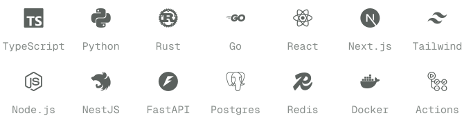
</picture>

What each one is based on → [SKILLS.md](SKILLS.md)

 

<picture>
  <source media="(prefers-color-scheme: dark)" srcset="assets/section-products-dark.svg">
  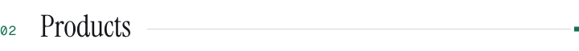
</picture>

Private codebases. Each row opens the public site or the case study.

<!-- work:products:start -->
<a href="https://datajewellers.com">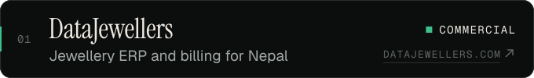</a> 
<a href="https://datarestro.com">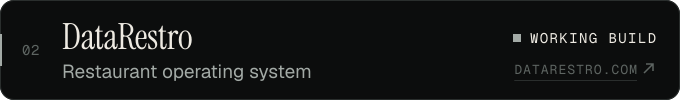</a> 
<a href="https://dataudaan.com">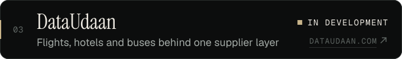</a> 
<a href="https://dataaccomodation.com">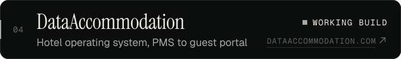</a> 
<a href="https://www.hellpuff.dev/work/dataitemize">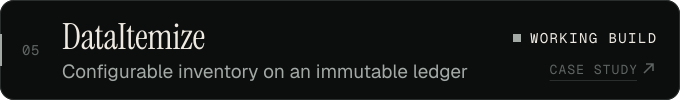</a> 
<a href="https://www.hellpuff.dev/work/timetravel">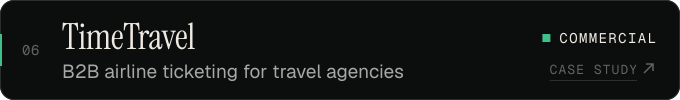</a> 
<a href="https://www.sitashreejewellers.com">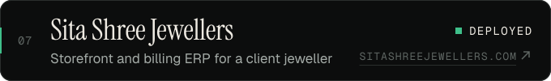</a>
<!-- work:products:end -->

 

<picture>
  <source media="(prefers-color-scheme: dark)" srcset="assets/section-systems-dark.svg">
  
</picture>

Open source unless the row says case study.

<!-- work:systems:start -->
<a href="https://www.hellpuff.dev/work/sugar-os">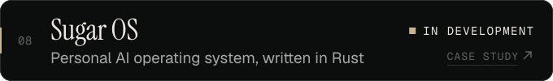</a> 
<a href="https://github.com/hellpuffyt/vercel-slm">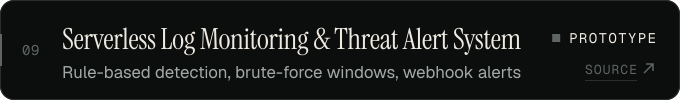</a> 
<a href="https://github.com/hellpuffyt/bellows-compiler">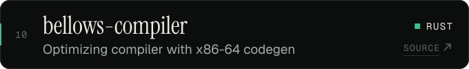</a> 
<a href="https://github.com/hellpuffyt/tesseradb">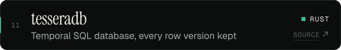</a> 
<a href="https://github.com/hellpuffyt/halyard-vm">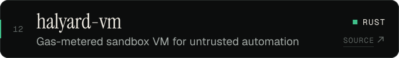</a> 
<a href="https://github.com/hellpuffyt/tarn-lang">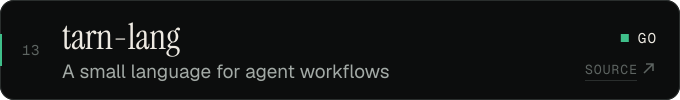</a> 
<a href="https://github.com/hellpuffyt/spindrift">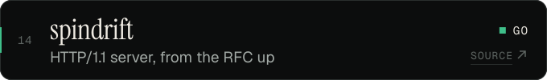</a> 
<a href="https://github.com/hellpuffyt/modelharbor">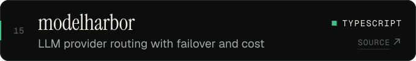</a>
<!-- work:systems:end -->

<picture>
  <source media="(prefers-color-scheme: dark)" srcset="assets/languages-dark.svg">
  
</picture>

Every public repository, grouped → [PROJECTS.md](PROJECTS.md)

 

<picture>
  <source media="(prefers-color-scheme: dark)" srcset="assets/section-focus-dark.svg">
  
</picture>

- Multi-tenant SaaS that stays simple as it grows
- Authorization at the API boundary, never in the browser
- Agents that touch real systems, with policy and replay
- Interfaces that make heavy operations feel calm

 

<a href="BRAND.md">brand</a>

