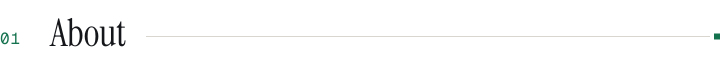
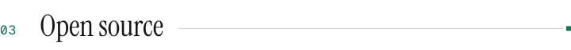
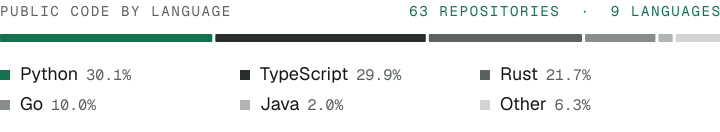
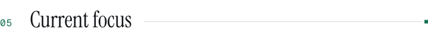
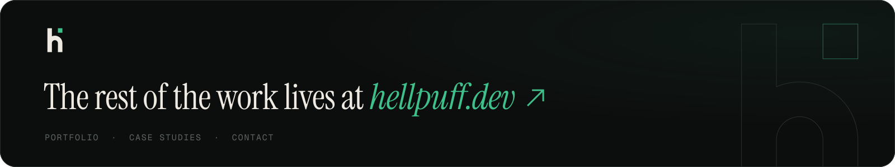

<picture>
  <source media="(prefers-reduced-motion: reduce)" srcset="assets/hellpuff-banner-static.svg">
  
</picture>

 

I'm **Prabesh Sharma**, a computer science engineering student and software engineer in Nepal. I build commercial SaaS platforms, and I build systems software from first principles to understand it properly.

**[hellpuff.dev ↗](https://www.hellpuff.dev)** &nbsp;·&nbsp; [Work](https://www.hellpuff.dev/work) &nbsp;·&nbsp; [CV](https://www.hellpuff.dev/cv) &nbsp;·&nbsp; [All public projects](PROJECTS.md) &nbsp;·&nbsp; [Skills](SKILLS.md)

 

<picture>
  <source media="(prefers-color-scheme: dark)" srcset="assets/section-about-dark.svg">
  
</picture>

I'm drawn to software where the engineering matters as much as the interface. Much of my work is multi-tenant business software for jewellers, restaurants, hotels and travel agencies, built under [Data Doodles Tech](https://datadoodlestech.com). Alongside it, I build systems to learn how they really work: a compiler with x86-64 code generation, a temporal SQL database, a sandboxed virtual machine, and an HTTP server written against its RFC.

I like tools that are honest about what they know: status pages derived from real checks, benchmarks that never print a number they didn't measure, parsers that say when a structure is ambiguous. This page follows the same rule. Everything links to something real, and private work is described without being exposed.

 

<picture>
  <source media="(prefers-color-scheme: dark)" srcset="assets/section-work-dark.svg">
  
</picture>

#### Business & SaaS

Commercial products. The codebases are private; each links to its public site and a case study on hellpuff.dev.

<table>
<tr><td>
<b><a href="https://datajewellers.com">DataJewellers</a></b> &nbsp;<code>COMMERCIAL</code> 
Jewellery management and billing for Nepal: stock by weight and purity, VAT bills at the day's rate, barcodes, and an isolated database schema for every business. Web, mobile and desktop clients. React · TypeScript · Express · Prisma · PostgreSQL · Expo · Tauri &nbsp;—&nbsp; <a href="https://datajewellers.com">datajewellers.com</a> · <a href="https://www.hellpuff.dev/work/datajewellers">case study</a>
</td></tr>
<tr><td>
<b><a href="https://datarestro.com">DataRestro</a></b> &nbsp;<code>WORKING BUILD</code> 
A restaurant operating system: point of sale, real-time kitchen display, recipe-level inventory and food cost, QR ordering, loyalty and analytics on one order record. Next.js · NestJS · Prisma · PostgreSQL · Redis · Socket.IO &nbsp;—&nbsp; <a href="https://datarestro.com">datarestro.com</a> · <a href="https://www.hellpuff.dev/work/restro-pos">case study</a>
</td></tr>
<tr><td>
<b><a href="https://dataudaan.com">DataUdaan</a></b> &nbsp;<code>IN DEVELOPMENT</code> 
Flights, hotels and buses across Nepal, India and the Gulf behind a single supplier layer, with customer, agent and admin portals. FastAPI · Next.js · PostgreSQL · Redis · Expo &nbsp;—&nbsp; <a href="https://dataudaan.com">dataudaan.com</a> · <a href="https://www.hellpuff.dev/work/dataudaan">case study</a>
</td></tr>
<tr><td>
<b><a href="https://dataaccomodation.com">DataAccommodation</a></b> &nbsp;<code>WORKING BUILD</code> 
A multi-tenant hotel operating system: property management, front desk, housekeeping, restaurant POS, booking engine, channel manager and guest portal on one data model. NestJS · Fastify · Next.js · Prisma · PostgreSQL &nbsp;—&nbsp; <a href="https://dataaccomodation.com">dataaccomodation.com</a> · <a href="https://www.hellpuff.dev/work/data-accommodation">case study</a>
</td></tr>
<tr><td>
<b>DataItemize</b> &nbsp;<code>WORKING BUILD</code> 
One inventory engine for many kinds of business, configured rather than coded, on an immutable stock ledger. FastAPI · SQLAlchemy · Next.js · PostgreSQL &nbsp;—&nbsp; <a href="https://www.hellpuff.dev/work/dataitemize">case study</a>
</td></tr>
<tr><td>
<b>TimeTravel</b> &nbsp;<code>COMMERCIAL</code> 
Multi-tenant B2B airline ticketing: agent booking portal, admin console, agency wallets with credit lines, and a pluggable flight-provider layer. Next.js · NestJS · Prisma · PostgreSQL · Redis &nbsp;—&nbsp; <a href="https://www.hellpuff.dev/work/timetravel">case study</a>
</td></tr>
<tr><td>
<b><a href="https://www.sitashreejewellers.com">Sita Shree Jewellers</a></b> &nbsp;<code>CLIENT · DEPLOYED</code> 
Storefront and billing ERP for a gold jeweller on New Road, Kathmandu. The first production deployment of the jewellery platform. Next.js · Prisma · PostgreSQL &nbsp;—&nbsp; <a href="https://www.sitashreejewellers.com">sitashreejewellers.com</a> · <a href="https://www.hellpuff.dev/work/sita-shree">case study</a>
</td></tr>
</table>

Also in the portfolio: <a href="https://www.hellpuff.dev/work/kinamna">Kinamna</a> (multi-vendor marketplace) · <a href="https://www.hellpuff.dev/work/geoland">Geoland System</a> (travel ticketing and finance) · <a href="https://www.hellpuff.dev/work/dataattendance">DataAttendance</a> · <a href="https://www.hellpuff.dev/work/dataconstruct">DataConstruct</a> · <a href="https://www.hellpuff.dev/work/multipaisa">MultiPaisa</a> · <a href="https://www.hellpuff.dev/work/talentsentinel">TalentSentinel</a>

#### Systems, AI & Security

<table>
<tr><td>
<b>Sugar OS</b> &nbsp;<code>IN DEVELOPMENT</code> 
A personal and company AI operating system in Rust: memory and retrieval, policy-gated agents, durable workflows, provider-agnostic model routing, and a phone as the command center. Rust · Tauri · Cedar · gRPC &nbsp;—&nbsp; <a href="https://www.hellpuff.dev/work/sugar-os">case study</a>
</td></tr>
<tr><td>
<b><a href="https://github.com/hellpuffyt/vercel-slm">Serverless Log Monitoring & Threat Alert System</a></b> &nbsp;<code>PROTOTYPE</code> 
A serverless function that checks incoming logs against detection rules (failed logins, admin access, SQL injection, scanner user agents), records incidents in Supabase, counts brute-force attempts per IP over five-minute windows, and sends webhook alerts. JavaScript · Vercel · Supabase &nbsp;—&nbsp; <a href="https://github.com/hellpuffyt/vercel-slm">source</a> · <a href="https://www.hellpuff.dev/work/slm">case study</a>
</td></tr>
</table>

 

<picture>
  <source media="(prefers-color-scheme: dark)" srcset="assets/section-open-source-dark.svg">
  
</picture>

Built from first principles, mostly without dependencies, each with a test suite and CI.

<table>
<tr>
<td width="50%" valign="top"><b><a href="https://github.com/hellpuffyt/bellows-compiler">bellows-compiler</a></b> Rust Optimizing compiler for a small typed language: parser, rustc-style diagnostics, IR, fixpoint optimizer and x86-64 code generation with DWARF line info.</td>
<td width="50%" valign="top"><b><a href="https://github.com/hellpuffyt/tesseradb">tesseradb</a></b> Rust Embedded temporal SQL database. Every row version is retained, so any query can run <code>AS OF</code> an earlier transaction. WAL recovery, no dependencies.</td>
</tr>
<tr>
<td valign="top"><b><a href="https://github.com/hellpuffyt/halyard-vm">halyard-vm</a></b> Rust Deterministic, gas-metered, capability-gated register VM for running untrusted automation, with snapshot and resume, an assembler and a debugger.</td>
<td valign="top"><b><a href="https://github.com/hellpuffyt/tarn-lang">tarn-lang</a></b> Go A small language for agent workflows: capability-gated tools, record and replay of every side effect, gradual static types, formatter and REPL.</td>
</tr>
<tr>
<td valign="top"><b><a href="https://github.com/hellpuffyt/spindrift">spindrift</a></b> Go Programmable HTTP/1.1 server on its own RFC 9112 stack: pipeline language, reverse proxy, server-sent events, rate limits and graceful drain.</td>
<td valign="top"><b><a href="https://github.com/hellpuffyt/packetlens">packetlens</a></b> Rust A readable packet inspector: pcap decoding, connection tracking and plain-English explanations of each flow.</td>
</tr>
<tr>
<td valign="top"><b><a href="https://github.com/hellpuffyt/modelharbor">modelharbor</a></b> TypeScript Control center for configured LLM providers: live health, task-aware routing with failover, and a usage-cost dashboard.</td>
<td valign="top"><b><a href="https://github.com/hellpuffyt/model-bench">model-bench</a></b> Python Benchmarks local LLM inference across runtimes (tokens per second, time to first token, memory ceiling) and never reports a number it didn't measure.</td>
</tr>
</table>

<picture>
  <source media="(prefers-color-scheme: dark)" srcset="assets/languages-dark.svg">
  
</picture>

More security, data and developer tooling, grouped by area → <a href="PROJECTS.md"><b>all public projects</b></a>

 

<picture>
  <source media="(prefers-color-scheme: dark)" srcset="assets/section-stack-dark.svg">
  
</picture>

<!-- toolkit:start -->
<table>
<tr><td><b>LANGUAGES</b></td><td>&nbsp;TypeScript &nbsp;&nbsp; &nbsp;Python &nbsp;&nbsp; &nbsp;Rust &nbsp;&nbsp; &nbsp;Go Also &nbsp;JavaScript · Java · C++ · C# · SQL</td></tr>
<tr><td><b>INTERFACE</b></td><td>&nbsp;React &nbsp;&nbsp; &nbsp;Next.js &nbsp;&nbsp; &nbsp;Tailwind CSS &nbsp;&nbsp; &nbsp;Vite Also &nbsp;Expo / React Native · Tauri · three.js</td></tr>
<tr><td><b>SERVICES</b></td><td>&nbsp;Node.js &nbsp;&nbsp; &nbsp;NestJS &nbsp;&nbsp; &nbsp;FastAPI &nbsp;&nbsp; &nbsp;Express Also &nbsp;Socket.IO</td></tr>
<tr><td><b>DATA</b></td><td>&nbsp;PostgreSQL &nbsp;&nbsp; &nbsp;Prisma &nbsp;&nbsp; &nbsp;SQLAlchemy &nbsp;&nbsp; &nbsp;Redis</td></tr>
<tr><td><b>DELIVERY</b></td><td>&nbsp;Docker &nbsp;&nbsp; &nbsp;GitHub Actions &nbsp;&nbsp; &nbsp;Vercel &nbsp;&nbsp; &nbsp;Linux Also &nbsp;Cloudflare</td></tr>
<tr><td><b>QUALITY</b></td><td>&nbsp;Vitest &nbsp;&nbsp; &nbsp;pytest &nbsp;&nbsp; Playwright &nbsp;&nbsp; cargo test</td></tr>
</table>
<!-- toolkit:end -->

What each entry is based on → <a href="SKILLS.md"><b>skills and evidence</b></a>

 

<picture>
  <source media="(prefers-color-scheme: dark)" srcset="assets/section-focus-dark.svg">
  
</picture>

These are the problems I'm working on and still learning in:

- **Maintainable SaaS.** Tenancy, billing and audit trails that stay simple as a product grows.
- **Secure backends and APIs.** Authorization enforced at the API boundary, not in the browser.
- **Reliable infrastructure.** Deployments, backups and recovery that are boring in the best way.
- **Workflow automation.** Taking repetitive engineering work off people's plates.
- **AI orchestration and developer tooling.** Routing, evaluation and policy for agents that touch real systems.
- **Product design.** Interfaces that make complex operations feel calm.

 

<a href="https://www.hellpuff.dev">hellpuff.dev</a> &nbsp;·&nbsp; <a href="BRAND.md">brand</a>

